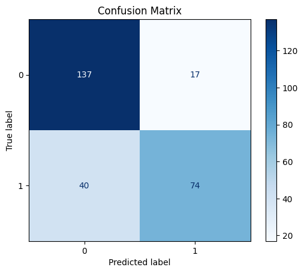

# API предсказания выживания на Титанике

Этот проект представляет собой API для предсказания выживания пассажиров на Титанике на основе их характеристик. API построено с использованием FastAPI и использует предварительно обученную модель машинного обучения.

## Описание

API принимает данные о пассажире и возвращает предсказание о том, выжил бы пассажир или нет. Модель учитывает следующие параметры:

- Класс пассажира (1, 2, 3)
- Пол (0 - мужской, 1 - женский)
- Возраст
- Количество братьев/сестер/супругов на борту
- Количество родителей/детей на борту
- Стоимость билета
- Порт посадки (Квинстаун или Саутгемптон)

## Установка и запуск

### Требования

- Python 3.8+
- Poetry для управления зависимостями
- Docker для контейнеризации

### Установка

1. Клонируйте репозиторий:

```bash
git clone [URL репозитория]
cd DecisionTreeClassifier
```

2. Установите зависимости с помощью Poetry:

```bash
poetry install
```

### Запуск

1. Запустите API локально:

```bash
poetry run python main.py
```

API будет доступно по адресу: http://0.0.0.0:8000

## Docker

Проект также может быть запущен с использованием Docker:

```bash
docker build -t titanic-prediction-api .
docker run -p 8000:8000 titanic-prediction-api
```

## API Endpoints

### POST /predict_model

Основной endpoint для получения предсказаний.

Пример запроса:

```json
{
  "Pclass": 1,
  "Sex": 1,
  "Age": 30.0,
  "SibSp": 0,
  "Parch": 0,
  "Fare": 50.0,
  "Embarked_Q": 0,
  "Embarked_S": 1
}
```

### GET /health

Проверка работоспособности API.

### GET /stats

Получение статистики использования API (количество запросов).

## Метрики модели

Модель была обучена на наборе данных Titanic и показывает следующие результаты:

### Основные метрики

- Accuracy: 0.79
- Средняя accuracy при кросс-валидации: 0.78

### Метрики по классам

#### Класс "Погиб"

- Precision: 0.77
- Recall: 0.89
- F1-score: 0.83

#### Класс "Выжил"

- Precision: 0.81
- Recall: 0.65
- F1-score: 0.72

#### Матрица ошибок



## Документация API

После запуска API, полная документация доступна по следующим URL:

- Swagger UI: http://localhost:8000/docs
- ReDoc: http://localhost:8000/redoc

## Лицензия

Этот проект лицензирован под лицензией MIT. Подробности можно найти в файле [LICENSE](LICENSE).

## Контакты

- **Имя**: Александр Волжанин
- **Email**: alexandervolzhanin2004@gmail.com
- **GitHub**: [m4deme1ns4ne](https://github.com/m4deme1ns4ne)
